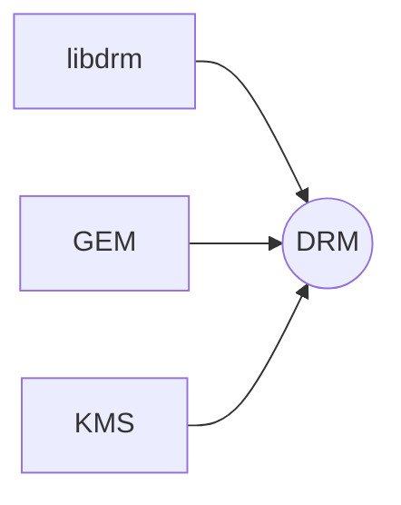

# DRM
# DRM与FB的优势
|特性|FB架构|DRM架构|
|-----|-----|-----|
|多图层合成|x|√|
|Vsync|x|√|
|DMA-BUF|x|√|
|异步更新|x|√|
|fence机制|x|√|
|统一管理驱动方便维护与升级|x|√|
# DRM架构描述
DRM架构相对较复杂，故可能比较啰嗦
## DRM构成
DRM概览架构如下图

```mermaid
flowchart LR;
    flag1((DRM))
    libdrm-->flag1
    GEM-->flag1
    KMS-->flag1
```